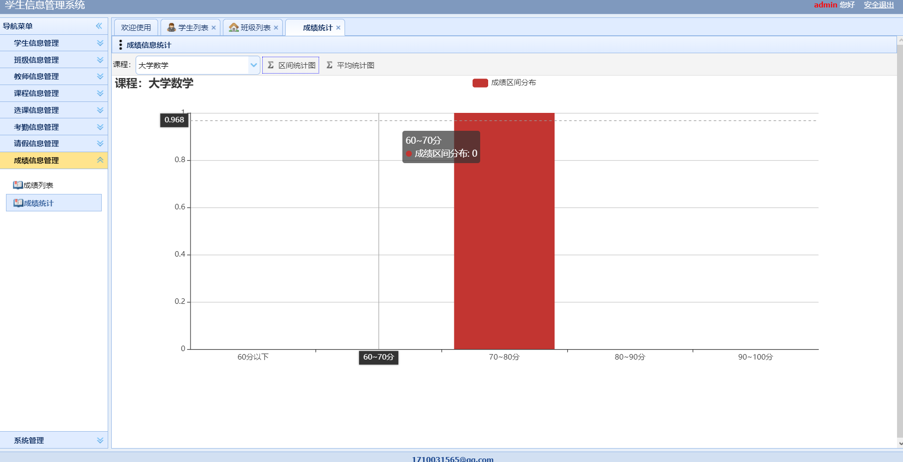

基于Springboot的学生信息管理系统
=
### 完整代码获取地址：从戎源码网 ([https://armycodes.com/](https://armycodes.com/))
### 作者微信：19941326836  QQ：952045282 
### 承接计算机毕业设计、Java毕业设计、Python毕业设计、深度学习、机器学习
### 选题+开题报告+任务书+程序定制+安装调试+论文+答辩ppt 一条龙服务
### 所有选题地址https://github.com/nature924/allProject

一、项目介绍
---
基于SpringBoot框架的实现的学生信息管理系统，本系统共分为3个角色：系统管理员、学生、教师，主要功能如下
在基于Spring Boot框架实现的学生信息管理系统中，共分为3个角色：系统管理员、学生、教师。系统提供以下主要功能：

### 【学生功能】：
1. 学生信息管理：学生可以查看和修改自己的个人信息，包括姓名、学号、性别等。
2. 选课信息管理：学生可以查看可选课程列表，并选择自己感兴趣的课程进行选课。
3. 考勤信息管理：学生可以查看自己的考勤记录，包括上课签到情况等。
4. 请假信息管理：学生可以提交请假申请，包括请假日期、请假原因等。
5. 成绩信息管理：学生可以查看自己的成绩和成绩详情，包括考试成绩、作业成绩等。
6. 系统管理：学生可以修改自己的登录密码和联系方式等。

### 【教师功能】：
1. 学生信息管理：教师可以查看学生列表，并进行学生信息的管理，包括添加、编辑、删除学生信息。
2. 班级信息管理：教师可以查看班级列表，并进行班级信息的管理，包括添加、编辑、删除班级信息。
3. 教师信息管理：教师可以查看和修改自己的个人信息，包括姓名、教工号、性别等。
4. 课程信息管理：教师可以查看课程列表，并进行课程信息的管理，包括添加、编辑、删除课程信息。
5. 选课信息管理：教师可以查看学生的选课情况，并进行选课信息的管理，包括添加、删除选课信息。
6. 考勤信息管理：教师可以查看学生的考勤情况，并进行考勤信息的管理，包括添加、编辑、删除考勤信息。
7. 请假信息管理：教师可以查看学生的请假申请，并进行请假信息的管理，包括批准、拒绝请假申请。
8. 成绩信息管理：教师可以录入学生的成绩，包括考试成绩、作业成绩等。
9. 系统管理：教师可以修改自己的登录密码和联系方式等。

### 【管理员功能】：
1. 学生信息管理：管理员可以查看学生列表，并进行学生信息的管理，包括添加、编辑、删除学生信息。
2. 班级信息管理：管理员可以查看班级列表，并进行班级信息的管理，包括添加、编辑、删除班级信息。
3. 教师信息管理：管理员可以查看教师列表，并进行教师信息的管理，包括添加、编辑、删除教师信息。
4. 课程信息管理：管理员可以查看课程列表，并进行课程信息的管理，包括添加、编辑、删除课程信息。
5. 选课信息管理：管理员可以查看学生的选课情况，并进行选课信息的管理，包括添加、删除选课信息。
6. 考勤信息管理：管理员可以查看学生的考勤情况，并进行考勤信息的管理，包括添加、编辑、删除考勤信息。
7. 请假信息管理：管理员可以查看学生的请假申请，并进行请假信息的管理，包括批准、拒绝请假申请。
8. 成绩信息管理：管理员可以录入学生的成绩，包括考试成绩、作业成绩等。
9. 系统管理：管理员可以管理系统的基本设置，包括修改管理员账号密码、备份数据库等操作。

二、项目技术
---
- 编程语言：Java
- 数据库：MySQL
- 项目管理工具：Maven
- 前端技术：VUE、HTML、Jquery、Bootstrap
- 后端技术：Spring、SpringMVC、MyBatis

三、运行环境
---
- 操作系统：Windows、macOS都可以
- JDK版本：JDK1.8以上都可以
- 开发工具：IDEA、Ecplise、Myecplise都可以
- 数据库: MySQL5.7以上都可以
- Tomcat：任意版本都可以
- Maven：任意版本都可以

四、运行截图
---

### 程序截图：

